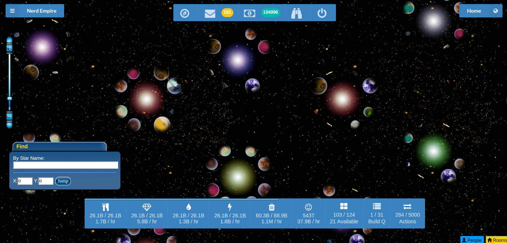

# Lacuna Web Client

>  Web Client for the [open source](http://www.lacunaexpanse.com/developers) game [The Lacuna Expanse](http://www.lacunaexpanse.com/).

# Ideas

Got an idea? [Let us know!](https://github.com/plainblack/Lacuna-Web-Client/issues)

# Hacking

If you're interested in hacking on the client, hit up the [developer's documentation](docs/README.md).

# License

See the [license file](LICENSE).
